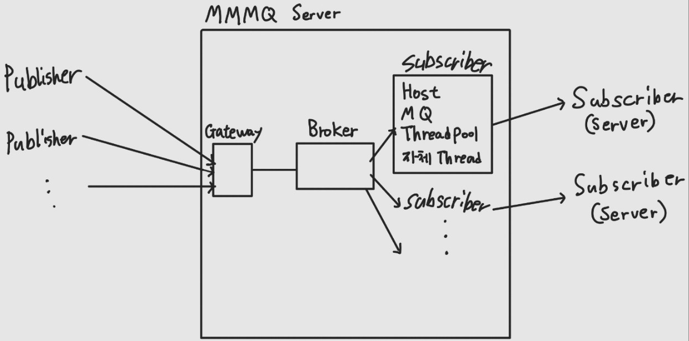

# MMMQ (Minimalistic Message Queue)

## 🎯 프로젝트 목적

**MMMQ**는 메시지 큐 시스템의 핵심 개념과 동작 원리를 학습하기 위한 교육용 프로젝트입니다.

- 📚 **학습 중심**: 메시지 큐의 철학과 내부 동작 과정에 대한 깊은 이해
- 🛠️ **실습 기반**: 직접 구현을 통한 이론과 실무의 결합
- 🌐 **오픈 소스**: 커뮤니티 피드백을 통한 지속적인 개선과 학습

## 🏗️ 아키텍처

### 시스템 흐름도

### 핵심 컴포넌트

#### 🌐 **MMMQGateway**
- **역할**: 웹 API 엔드포인트 제공
- **기능**: Publisher로부터 메시지를 수신하여 Broker로 전달

#### 🔄 **Broker**
- **역할**: 메시지 라우팅 중개자
- **기능**: 토픽 기반으로 구독 중인 MessageDispatcher들에게 메시지 브로드캐스트

#### 📬 **MessageDispatcher**
- **역할**: 메시지 소비 및 전달
- **기능**: 
  - 내장 메시지 큐를 통한 버퍼링
  - 독립 스레드 + 스레드 풀을 활용한 비동기 메시지 처리
  - HTTP를 통한 최종 소비자(Host)로의 메시지 전달

## 🚀 설치 및 사용 방법
공식 배포 후 업데이트 예정입니다.

## 👥 참여자

모든 코드는 **페어 프로그래밍**으로 작성되었습니다.

<table>
  <tr height="140px">
    <td align="center">
      
       
      <a href="https://github.com/cookie-meringue">머랭</a>
    </td>
      <td align="center">
      
       
      <a href="https://github.com/songsunkook">모코</a>
    </td>
  </tr>
</table>

## ⚖️ 라이선스

이 프로젝트는 교육 목적으로 제작되었습니다.
